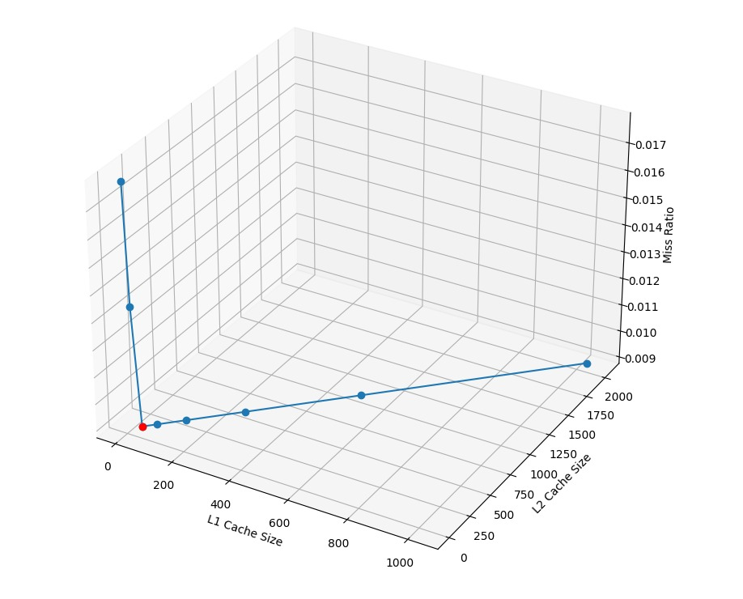

# Advanced Computer Architecture

Name : Mohammad Zaid

Roll Number : 2021101004

## Question 1

(a)

```jsx
#include <iostream>
#include <vector>

using namespace std;

double dotProduct(const vector<double>& vector1, const vector<double>& vector2) 
{	
    double dot = 0.0;
    for (size_t i = 0; i < vector1.size(); ++i) 
		{
        dot += vector1[i] * vector2[i];
    }
    return dot;
}

int main() 
{
    vector<double> vector_a = {1, 2, 3};
    vector<double> vector_b = {4, 5, 6};

    double result = dotProduct(vector_a, vector_b);
    cout << " dot product : " << result << endl;

    return 0;
}
```

(b)

```jsx
#include <iostream>
#include <vector>
#include <immintrin.h>

int dot_product_vectorized(const std::vector<int> &x, const std::vector<int> &y)
{
    const size_t vectorSize = x.size();
    const size_t simdSize = 8; // AVX2 registers can handle 8 integers at a time

    __m256i sum = _mm256_setzero_si256();

    for (size_t i = 0; i < vectorSize; i += simdSize)
    {
        __m256i x_vec = _mm256_loadu_si256((__m256i *)&x[i]);
        __m256i y_vec = _mm256_loadu_si256((__m256i *)&y[i]);

        __m256i prod = _mm256_mullo_epi32(x_vec, y_vec);
        sum = _mm256_add_epi32(sum, prod);
    }

    alignas(32) int result[8];
    _mm256_store_si256((__m256i *)result, sum);

    int finalResult = 0;
    for (int i = 0; i < simdSize; ++i) {
        finalResult += result[i];
    }

    return finalResult;
}

int main()
{
    std::vector<int> x = {1, 2, 3, 4, 5, 6, 7, 8};
    std::vector<int> y = {2, 3, 4, 5, 6, 7, 8, 9};

    try
    {
        int result = dot_product_vectorized(x, y);
        std::cout << "Dot product of all elements: " << result << std::endl;
    }
    catch (const std::invalid_argument &e)
    {
        std::cerr << "Error: " << e.what() << std::endl;
    }

    return 0;
}
```

(c) Dot product program to compute for even indices

```jsx
#include <iostream>
#include <vector>
#include <immintrin.h>

int dot_product_even_indices(const std::vector<int>& x, const std::vector<int>& y) {

    __m256i sum = _mm256_setzero_si256();

    for (size_t i = 0; i < x.size(); i += 8)
		{
        __m256i x_vec = _mm256_loadu_si256((__m256i*)&x[i]);
        __m256i y_vec = _mm256_loadu_si256((__m256i*)&y[i]);

        __m256i mask = _mm256_setr_epi32(0, -1, 0, -1, 0, -1, 0, -1);

        //   mask to filter out even indices
        x_vec = _mm256_and_si256(x_vec, mask);
        y_vec = _mm256_and_si256(y_vec, mask);

        __m256i prod = _mm256_mullo_epi32(x_vec, y_vec);
        sum = _mm256_add_epi32(sum, prod);
    }

    alignas(32) int result[8];
    _mm256_store_si256((__m256i*)result, sum);

    return result[0] + result[1] + result[2] + result[3] + result[4] + result[5] + result[6] + result[7];
}

int main() 
{
    std::vector<int> x = {1, 2, 3, 4, 5, 6, 7, 8}; 
	  int result = dot_product_even_indices(x, y);
		cout<<result;
    return 0;
}
```

(d) Program to compute memory bandwidth of our system : 

```jsx
#include <iostream>
#include <chrono>

const long long ARRAY_SIZE = 1000000000;
const int NUM_RUNS = 10;

void stream_copy(double* dest, const double* src, long long size) 
{
    for (long long i = 0; i < size; ++i) {
        dest[i] = src[i];
    }
}

int main()
{
    double total_bandwidth = 0.0;
    for(int run = 0; run < NUM_RUNS; ++run) 
	{
        double* A = new double[ARRAY_SIZE];
        double* B = new double[ARRAY_SIZE];
        for(long long i = 0; i < ARRAY_SIZE; ++i) 
        {
            A[i] = 1.0;
            B[i] = 2.0;
        }
        auto start = std::chrono::high_resolution_clock::now();
        //  memory-bound operation (streaming copy)
        stream_copy(A, B, ARRAY_SIZE);
        auto end = std::chrono::high_resolution_clock::now();
        std::chrono::duration<double> duration = end - start;
        double bandwidth = (double(ARRAY_SIZE) * sizeof(double)) / (duration.count() * 1e9);
        total_bandwidth += bandwidth;
        delete[] A;
        delete[] B;
    }
    double average_bandwidth = total_bandwidth / NUM_RUNS;
    std::cout << "Average Memory Bandwidth: " << average_bandwidth << " GB/s" << std::endl;
    return 0;
}
```

(e)My cpu frequency is **3.2 GHz.**

Assuming AVX2 support and 8 FLOPs per cycle per core.

```jsx
import os
import multiprocessing

cores = multiprocessing.cpu_count() 
frequency = 3.2  
flops_per_cycle_per_core = 8  
peak_gflops = cores * frequency * flops_per_cycle_per_core
	
print(f"Number of Cores: {cores}")
print(f"CPU Frequency (GHz): {frequency}")
print(f"Estimated Peak GFLOPS: {peak_gflops:.2f}")
```

Thus we get : **Estimated Peak GFLOPS/sec: 224.00**

(f) From above data we see that a program is compute bound if and only if 

Operational Intensity ≥ 159.91 FLOPS/Byte.

We got the above by using roofline analysis , dividing peak GFLOPS WITH the bandwidth.  

Now we will calculate operational intensity for each of the above cases:

| Program | Number of Operations | Byte Accessed | Operations per Byte |
| --- | --- | --- | --- |
| Scalar Dot Product (1-a) | 2*n | 2n*4 | 1/4 |
| Vectorised Dot Product(1-b) | 2*n/8 | 2n*4 | 1/32 |
| Vectorised Dot Product for even indices(1-c) | 4*n/8 | 2n*4 | 1/16 |

We see that all of them is much less than the operational intensity 159.951 FLOPS/BYTE.

Thus all of them are memory bound program.

---

### Question 2

(a) Usual 3-D Loop : 

```jsx
void matrixMul(int n, int** matrixA, int** matrixB, int** matrixC)
{   
    int row = 0;
    int col = 0;
    int k = 0;
    for(row = 0; row < n; row++)
    {
        for(col = 0; col < n; col++)
        {
            for(k = 0; k < n; k++)
            {
                 matrixC[row][col] +=  matrixA[row][k] * matrixB[k][col];
            }
         }
    }
    return ;
}
```

Strassen’s Multiplication:

```jsx

void add(vector<vector<int>>& A, vector<vector<int>>& B, vector<vector<int>>& C, int size) 
{
    for (int i = 0; i < size; i++)
        for (int j = 0; j < size; j++)
            C[i][j] = A[i][j] + B[i][j];
}

void subtract(vector<vector<int>>& A, vector<vector<int>>& B, vector<vector<int>>& C, int size) 
{
    for (int i = 0; i < size; i++)
        for (int j = 0; j < size; j++)
            C[i][j] = A[i][j] - B[i][j];
}

// Strassen's Matrix Multiplication
void strassen(vector<vector<int>>& A, vector<vector<int>>& B, vector<vector<int>>& C, int size) 
{
    if (size == 1) 
	{
        C[0][0] = A[0][0] * B[0][0];
        return;
    }

    int newSize = size / 2;
    vector<int> inner(newSize);
    vector<vector<int>> 
        A11(newSize, inner), A12(newSize, inner), A21(newSize, inner), A22(newSize, inner),
        B11(newSize, inner), B12(newSize, inner), B21(newSize, inner), B22(newSize, inner),
        C11(newSize, inner), C12(newSize, inner), C21(newSize, inner), C22(newSize, inner),
        M1(newSize, inner), M2(newSize, inner), M3(newSize, inner), M4(newSize, inner),
        M5(newSize, inner), M6(newSize, inner), M7(newSize, inner),
        AResult(newSize, inner), BResult(newSize, inner);

    // Dividing the matrices into sub-matrices
    for (int i = 0; i < newSize; i++)
	{
        for (int j = 0; j < newSize; j++) 
		{
            A11[i][j] = A[i][j];
            A12[i][j] = A[i][j + newSize];
            A21[i][j] = A[i + newSize][j];
            A22[i][j] = A[i + newSize][j + newSize];

            B11[i][j] = B[i][j];
            B12[i][j] = B[i][j + newSize];
            B21[i][j] = B[i + newSize][j];
            B22[i][j] = B[i + newSize][j + newSize];
        }
    }

    // Calculating M1 to M7
    add(A11, A22, AResult, newSize);
    add(B11, B22, BResult, newSize);
    strassen(AResult, BResult, M1, newSize);

    add(A21, A22, AResult, newSize);
    strassen(AResult, B11, M2, newSize);

    subtract(B12, B22, BResult, newSize);
    strassen(A11, BResult, M3, newSize);

    subtract(B21, B11, BResult, newSize);
    strassen(A22, BResult, M4, newSize);

    add(A11, A12, AResult, newSize);
    strassen(AResult, B22, M5, newSize);

    subtract(A21, A11, AResult, newSize);
    add(B11, B12, BResult, newSize);
    strassen(AResult, BResult, M6, newSize);

    subtract(A12, A22, AResult, newSize);
    add(B21, B22, BResult, newSize);
    strassen(AResult, BResult, M7, newSize);

    // Calculating C11, C12, C21, and C22
    add(M1, M4, AResult, newSize);
    subtract(M7, M5, BResult, newSize);
    add(AResult, BResult, C11, newSize);

    add(M3, M5, C12, newSize);

    add(M2, M4, C21, newSize);

    add(M1, M3, AResult, newSize);
    subtract(M6, M2, BResult, newSize);
    add(AResult, BResult, C22, newSize);

    // Grouping the results into the final matrix
    for (int i = 0; i < newSize; i++)
		{
	        for (int j = 0; j < newSize; j++)
					{
            C[i][j] = C11[i][j];
            C[i][j + newSize] = C12[i][j];
            C[i + newSize][j] = C21[i][j];
            C[i + newSize][j + newSize] = C22[i][j];
	        }
    }
}
```

(b) We get the following data for the various matrix sizes by varying k. Note that N was varied till 512 only otherwise it will take too much time for benchmarking of an N^3 algorithm(Strassen Matrix Multiplication has large constant factor so it takes too much time for N=2^10).

Strassen Multiplication

| N | Instructions Executed | CPI | L1 Miss % | L2 Miss % | L3 Miss % |
| --- | --- | --- | --- | --- | --- |
| 16 | 2,45,64,458 | 0.701 | 0.694 | 51.5 | 44.34 |
| 32 | 15,06,13,788 | 0.561 | 0.410 | 44.81 | 45.15 |
| 64 | 1,03,52,18,260 | 0.524 | 0.055 | 37.38 | 27.15 |
| 128 | 7,23,96,36,384 | 0.558 | 0.045 | 25.02 | 44.63 |
| 256 | 50,69,81,59,824 | 0.530 | 0.541 | 23.04 | 40.05 |
| 512 | 3,55,00,11,03,750 | 0.523 | 0.331 | 21.64 | 29.11 |

Usual 3d Loop 

| N | Instructions Executed | CPI | L1 Miss % | L2 Miss % | L3 Miss % |
| --- | --- | --- | --- | --- | --- |
| 16 | 41,91,870 | 0.704 | 3.68 | 46.45 | 36.7 |
| 32 | 79,18,084 | 0.534 | 1.61 | 46.44 | 34.6 |
| 64 | 3,72,19,883 | 0.390 | 0.34 | 46.27 | 19.21 |
| 128 | 26,86,90,181 | 0.331 | 0.23 | 30.40 | 28.15 |
| 256 | 2,11,17,85,064 | 0.458 | 0.35 | 13.80 | 32.61 |
| 512 | 16,82,39,95,629 | 0.413 | 3.69 | 24.11 | 10.55 |

Code executed(mmap is used because sbrk can work only upto a certain limit in cachegrind) : 

```jsx
void cal()
{
	const int n=4000;
	float* X = new float[n];
	float* A = new float[n];
	float (B)[n]=(float()[n])mmap(NULL,n*n*sizeof(float),PROT_READ | PROT_WRITE, MAP_PRIVATE | MAP_ANONYMOUS, -1, 0);
	for(int i=0;i<n;i++)
	{
	
    	X[i]=(i%2==0)?3:5;
		for(int j=0;j<n;j++)
			B[i][j]=(j%2==0)?5:8;
	}
	for(int i=0;i<n;i++)
	{
		A[i]=0;
		for(int j=1;j<n-1;j++)
		{
			A[i]+=0.33*(B[i][j]*X[j]);
		}
	}
    return ;
}
```

(c) Tiled Version of Matrix Multiplication :

```jsx
void mulBlocking(int n, double** matrixA, double** matrixB, double** matrixC)
{
    int block_size = BLOCK_SIZE; 
    int row_start = 0;
    int col_start = 0;
    int k_start = 0;
    int row = 0;
    int col = 0;
    int k = 0;
    for(row_start = 0; row_start < n; row_start += block_size)
    {
        for(col_start = 0; col_start < n; col_start += block_size)
        {
            for(k_start = 0; k_start < n; k_start += block_size)
            {
                for(row = 0; row < block_size; row++)
                {
                    for(col = 0; col < block_size; col++)
                    {
                        for(k = 0; k < block_size; k++)
                        {
                            matrixC[row_start + row][col_start + col] += 
                                matrixA[row_start + row][k_start + k] * 
                                matrixB[k_start + k][col_start + col];
                        }
                    }
                }
            }
        }
    }
}
```

We get the following analytics for blocked matrix multiplication : 

| Dr | D1mr | DLmr | Dw | D1mw | DLmw | Block Size |
| --- | --- | --- | --- | --- | --- | --- |
| 3,623,878,656 | 3,972,995 | 1,105,401 | 134,217,728 | 0 | 0c | 8  |
| 3,623,878,656 | 1,536,032 | 568,817 | 134,217,728 | 0 | 0 | 16 |
| 3,623,878,656 | 661,659 | 300,513 | 134,217,728 | 0 | 0 | 32 |
| 3,623,878,656 | 479,940 | 166,337 | 134,217,728 | 0 | 0 | 64 |
| 3,623,878,656 | 9,321,210 | 99,201 | 134,217,728 | 0 | 0 | 128 |

Notice that D1mw and Dlmw is zero as matrixC[i][j]+=….. ⇒ matrix element at {i,j} is first loaded and then write is done , hence its in the cache because of the prior load.

Similarly we get the following analytics for recursive strassen’s matrix multiplication :

| Dr | D1mr | DLmr | Dw | D1mw | DLmw |
| --- | --- | --- | --- | --- | --- |
| 754,353,232 | 403,456 | 25,499 | 569,298,260 | 422,241 | 219,509 |

We note that recursive strassen’s matrix multiplication performs close to blocked matrix multiplication(Cache oblivious algorithm).

Also compare instructions executed?

### Question 3

Given code snippet : 

```jsx
for (i = 0; i < n - 1; i++) 
{
	S1: A[i] = 0
	for (j = 1; j < n - 1; j++)
		 S2: A[i] += 0.33*(B[i][j] * X[j])
}
```

We get the following data by varying L1,L2 and L3 cache sizes.

We vary in the following way : 

Row 1 →  8     KB L1   and 016 KB L2

Row 2 → 16    KB L1   and 032 KB L2

Row 3 → 32   KB L1   and 064 KB L2

Row 4 → 64   KB L1   and 128 KB L2

Row 5 → 128  KB L1   and 256 KB L2

Row 6 → 256  KB L1  and 512 KB L2

Row 7 → 512   KB L1  and 001 MB L2

Row 8 → 001   MB L1 and 002 MB L2

S1 : 

| Dr | D1mr | DLmr | Dw | D1mw | Dlmw |
| --- | --- | --- | --- | --- | --- |
| 8000 | 0 | 0 | 4000 | 250 | 250 |
| 8000 | 0 | 0 | 4000 | 250 | 250 |
| 8000 | 0 | 0 | 4000 | 250 | 250 |
| 8000 | 0 | 0 | 4000 | 250 | 250 |
| 8000 | 0 | 0 | 4000 | 250 | 250 |
| 8000 | 0 | 0 | 4000 | 250 | 250 |
| 8000 | 0 | 0 | 4000 | 250 | 250 |
| 8000 | 0 | 0 | 4000 | 250 | 250 |

**For S1 , we can see that all the misses are the compulsory misses , so increasing cache size doesn’t offer any improve in performance.**

S2: 

| Dr  | D1mr  | DLmr  | Dw  | D1mw  | DLmw |
| --- | --- | --- | --- | --- | --- |
| 207,896,000 | 2,004,000 | 2,004,000 | 15,992,000 | 0 | 0 |
| 207,896,000 | 2,004,000 | 1,000,251 | 15,992,000 | 0 | 0 |
| 207,896,000 | 1,000,251 | 1,000,251 | 15,992,000 | 0 | 0 |
| 207,896,000 | 1,000,250 | 1,000,250 | 15,992,000 | 0 | 0 |
| 207,896,000 | 1,000,250 | 1,000,250 | 15,992,000 | 0 | 0 |
| 207,896,000 | 1,000,249 | 1,000,249 | 15,992,000 | 0 | 0 |
| 207,896,000 | 1,000,248 | 1,000,247 | 15,992,000 | 0 | 0 |
| 207,896,000 | 1,000,246 | 1,000,243 | 15,992,000 | 0 | 0 |

**For S2, we can see that write misses are zero, because data to be written - A[i] is already brought in the cache by S1.**

We can see that the optimal cache configuration is : 

**32 KB L1 , 64 KB L2** 

Note that miss ratio is calculated by combining  the read and write misses , and also combining  the L1 and L2 misses.



From the above graph we can see that after the red point , there is no significant reduction in miss ratio even if the cache sizes are increased. Thus the point **32 KB L1 , 64 KB L2**  is optimal.